###### pjandlou.github.io

## property

- 14 Nosband Ave. #3J White Plains NY 10605

## description

Great location. Very nice large 1 bedroom unit.

Across the street from Mamaroneck Avenue Elementary School. Easy walking distance to CVS, Dunne's Pub, Francesco's Restaurant, Chase-Manhattan Bank and more. A 3/4 mile walk to White Plains Hospital. A 1+1/2 mile walk to train station.

- 966 sq. ft.
- 1 bedroom
    - large walk-in closet
    - easily fits queen size bed
- 1 bath
    - bath/shower and toilet behind closed door
    - sink area
    - storage closet
- entry hall with closet
- kitchen
    - dishwasher
    - refrigerator
    - stove/oven
    - sink
    - plenty of cabinets
- dining area
- large living room
- garage parking (included)
    - room for one car
    - unheated open storage space
- additional off-street uncovered parking spaces available (not included)

## location

Click on map to visit google maps.

<a href="https://www.google.com/maps/place/14+Nosband+Ave,+White+Plains,+NY+10605/@41.0204084,-73.762266,17z/data=!3m1!4b1!4m6!3m5!1s0x89c2943d330bb867:0x28e35b5489dd9458!8m2!3d41.0204084!4d-73.7596911!16s%2Fg%2F11c1jdfx2m?entry=ttu">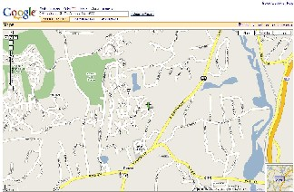</a>

## condo services

The unit includes the below services.

- elevator
- on-site laundry
- trash collection
- maintenance
    - lawn mowing and shrub trimming
    - snow plowing driveways and walkways

## condo amenities

- fitness center
- sauna
- roof-top deck
- recreation room
- pool table

## terms

- One year lease
- Tenant pays rent + utilities (phone,electric,cable)
- Landlord pays water, sewer and maintenance
- No smoking
- Pets considered

<table class="myTable">
<tr align="left">
<th>description
<th>frequency
<th>pay to
<th>pay by
<th>fee amount
</tr>
<tr align="left">
<td>application fee
<td>one time
<td>Finger Management
<td>tenant
<td>$300
</tr>
<tr align="left">
<td>move-in fee
<td>one time
<td>Finger Management
<td>tenant
<td>$350
</tr>
<tr align="left">
<td>move-out fee
<td>one time
<td>Finger Management
<td>tenant
<td>$350
</tr>
<tr align="left">
<td>leasing fee
<td>annual
<td>Finger Management
<td>tenant
<td>$100
</tr>
<tr align="left">
<td>rent
<td>monthly
<td>landlord
<td>tenant
<td>current rental fee
</tr>
</table>

## documents
    
- Rental Application: [form](docs/common/Application.pdf)
- Fixed Term Residential Lease: [form](docs/common/Lease.pdf)
- Regency sales-lease application: [form](docs/3j/regency%20sales-lease%20application.pdf)
- Regency dogs policy and registration: [form](docs/3j/regency%20dogs.pdf)
- Regency garage: [notice](docs/3j/regency%20garage.pdf)
- Lnadlord contact: [info](docs/common/ContactInfo.pdf)

## images

##### building front & lobby

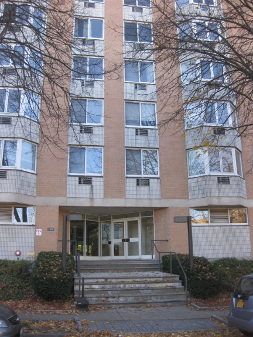
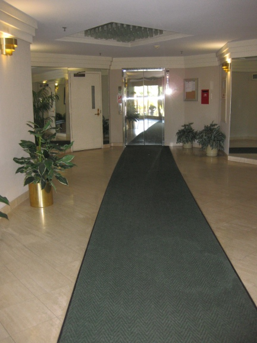

##### sidewalk & street

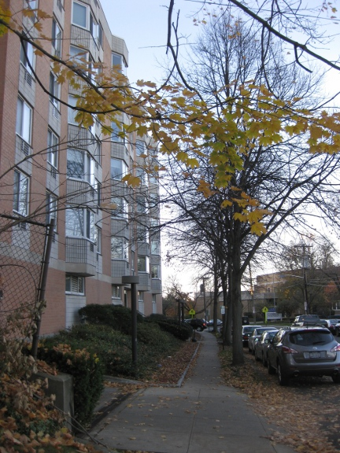
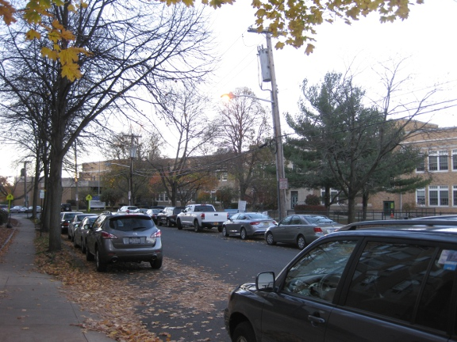

##### living & dining rooms

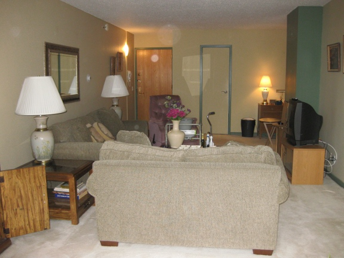
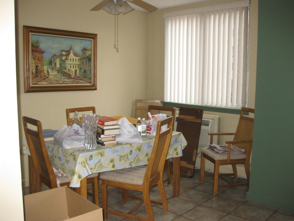

##### hallway & kitchen

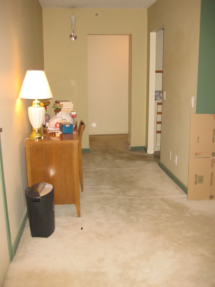
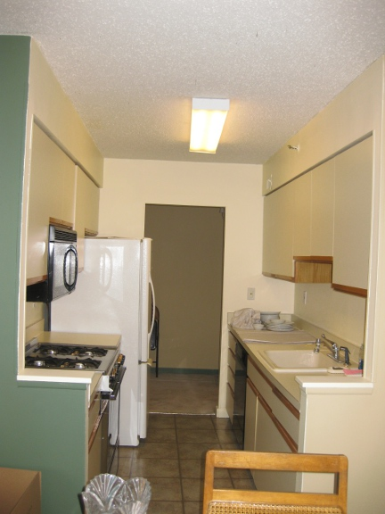

##### bathroom

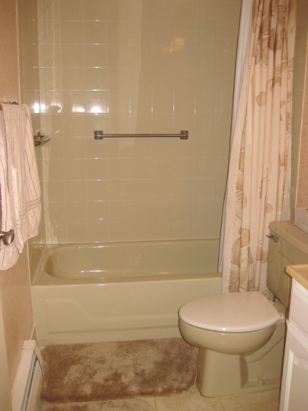
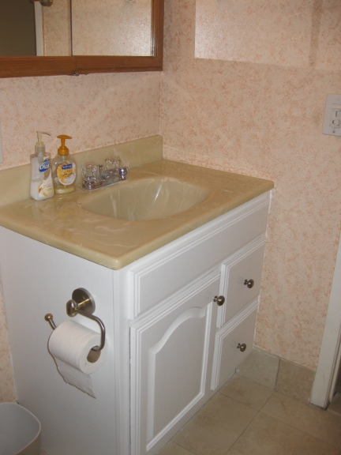

##### bedroom

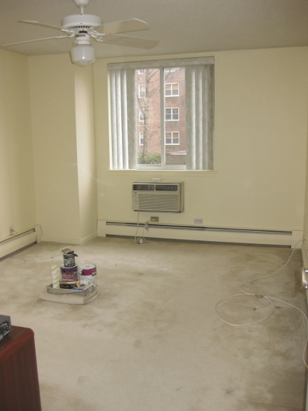
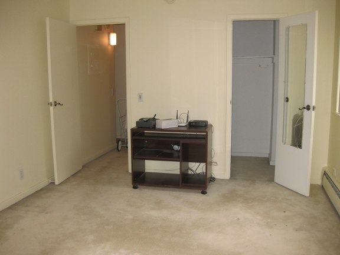

##### closets

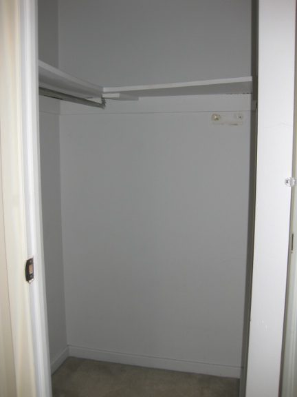
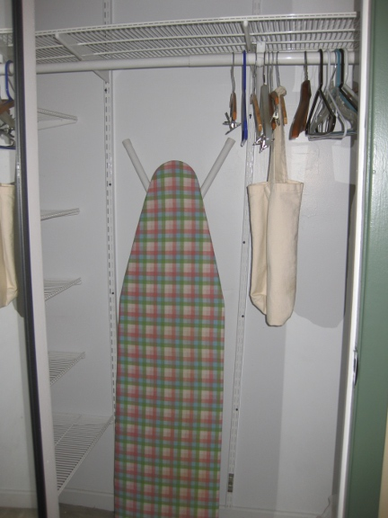
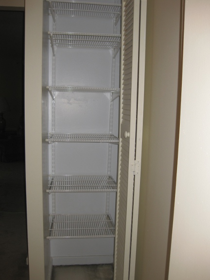

##### laundry, roof deck

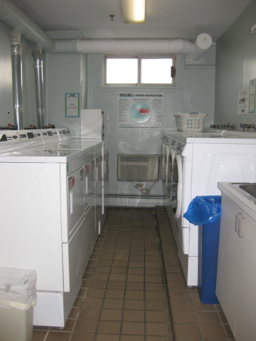
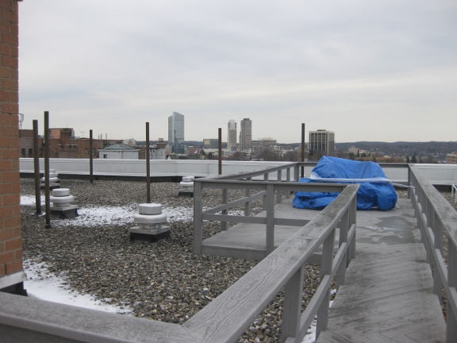

##### sauna & exercise

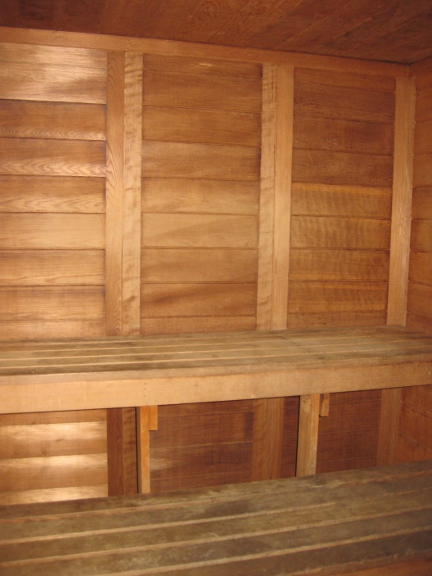
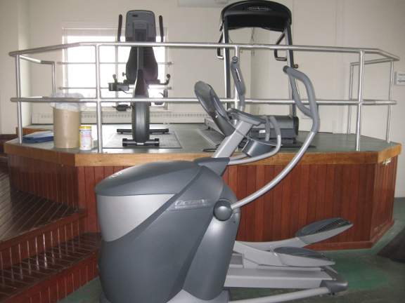
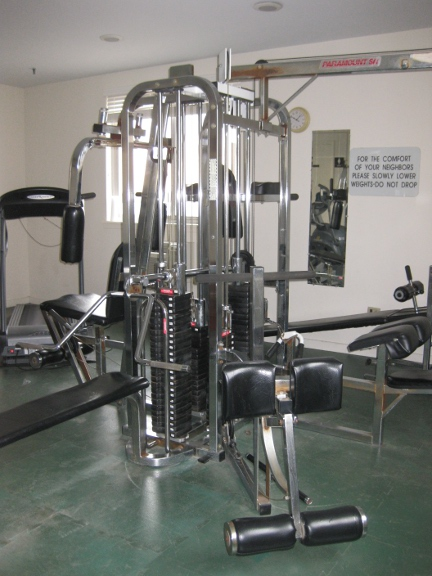

##### garage parking (assigned space)

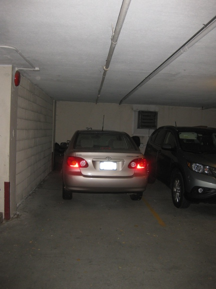

##### floor plan

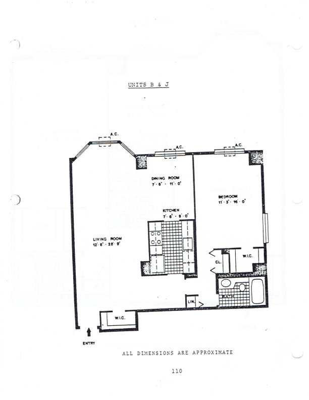
